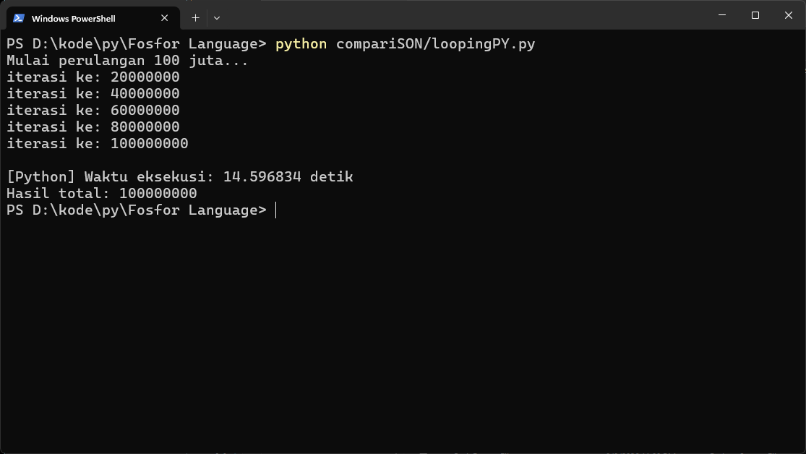
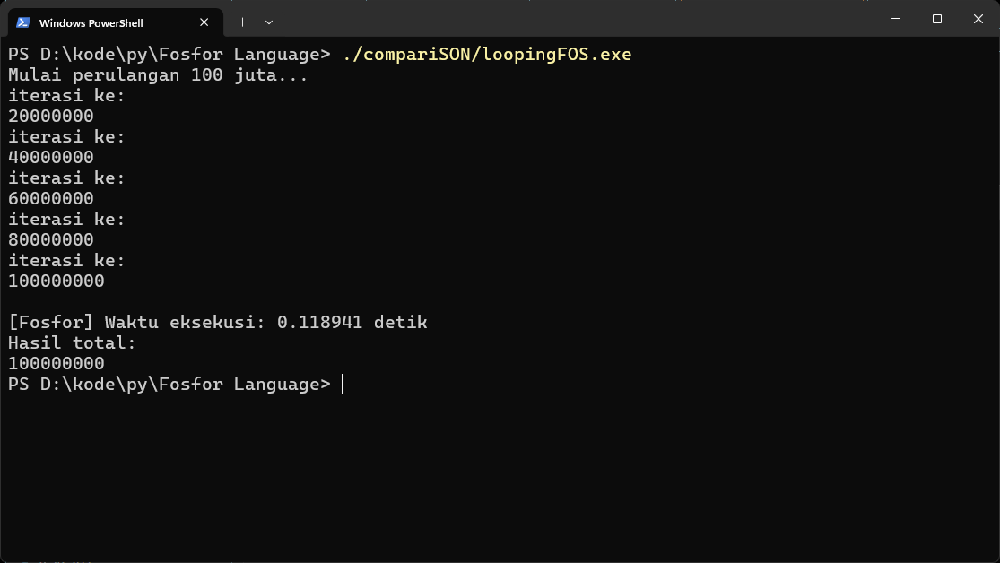
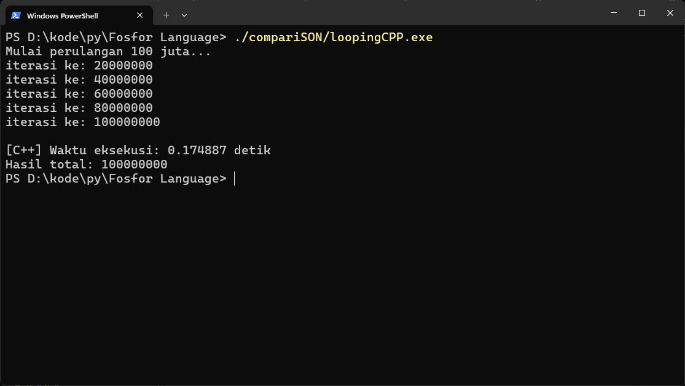
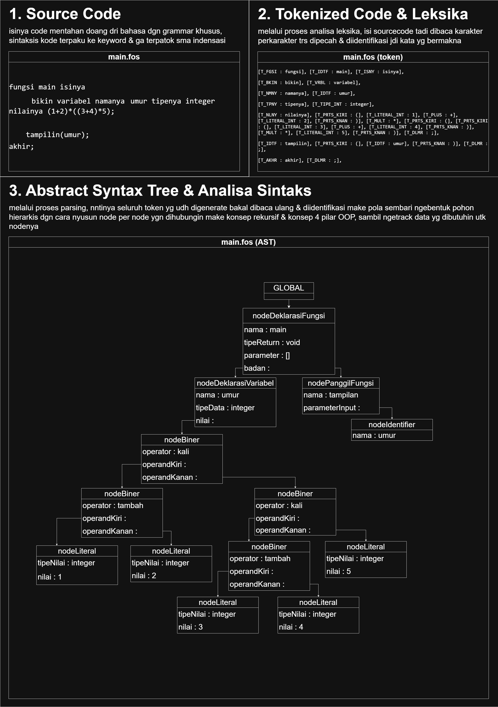
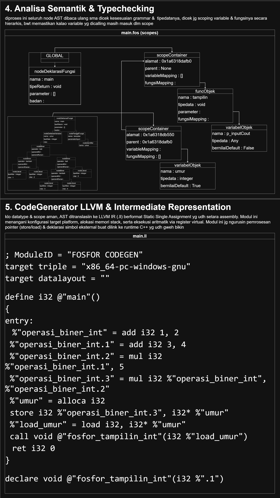
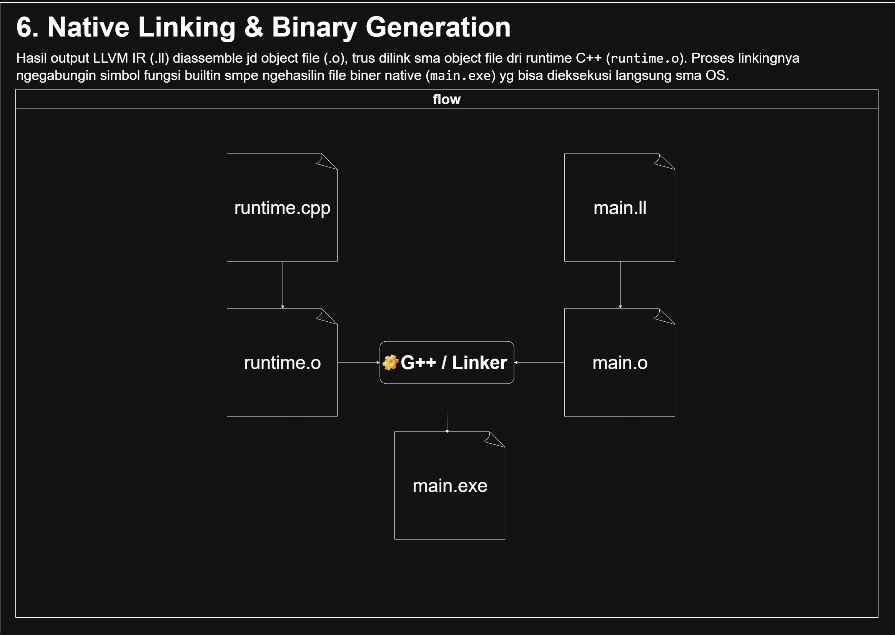

# Fosfor Language
project bikin bhs pemrograman kustom dgn metode compiled yg ditulis dari 0 tanpa mke tools bantuan (ANTLR, yacc, Bison) dgn base compilernya dibentuk dari python yg kemudian disupport make LLVM utk generasi .exe nya

## Benchmark
disini terdapat 2 bahasa pemrograman populer yg disandingin sma bhsa Fosfor sbg perbandingan performa, masing masing bahasa ditest untuk melakukan perulangan sebanyak 100 juta kali putaran

<p align="left">
  &nbsp;
  &nbsp;
  &nbsp;
</p>

dari gambar tersebut terlihat bahwa:
- **Fosfor** selesai dengan waktu : 0.118941 detik
- **C++** selesai dengan waktu : 0.174887 detik
- **Python** selesai dengan waktu : 14.596834 detik

benchmark ini dilaksanakan dengan mengeksekusi langsung file executeablenya, bukan dari waktu kompilasi

## Status & Target Pengembangan
sejauh ini pengembangannya masih minim fitur & masih banyak safeguard yg jebol karena emng targetnya minimum viable product dulu + buat belajar & iseng isengan doang, utk target kedepannya sih blm tau entah mau ngefix safeguard / nambahin fitur fitur lain lagi, who knows? wkwk

### fitur fitur yg udah dibikin:
- Percabangan (If, Else If, Else)
- Perulangan While
- Deklarasi Variabel
- Deklarasi Fungsi
- Penugasan Nilai
- Tipedata Primitive

### planning fitur kedepannya (klo ada niatan & waktu bwt ngelanjutin wkwk):
- Support Tipedata Komposit (Pointer, Vektor, Unordered Map)
- Import Modul
- Perulangan Each
- Passby Reference & Passby Value
- Deklarasi Variabel Stack & Heap


## Contoh Sintaks Fosfor

```fosfor
fungsi main isinya
    bikin variabel namanya total tipenya integer nilainya 0;
    bikin variabel namanya i tipenya integer nilainya 1;

    tampilin("Mulai perulangan 100 juta...");

    mulaiTimer();

    ngulangin selama (i <= 100000000) isinya
        total++;

        kalau (i % 20000000 == 0) isinya
            tampilin("iterasi ke:");
            tampilin(i);
        akhir

        i++;
    akhir

    stopTimer();

    tampilin("Hasil total:");
    tampilin(total);
akhir;
```

## Arsitektur
mybe perjalanan dari sourcecode sampe ke executable klo divisualisasiin bentuknya gini:
<p align="left">
  &nbsp;
  &nbsp;
  &nbsp;
</p>
